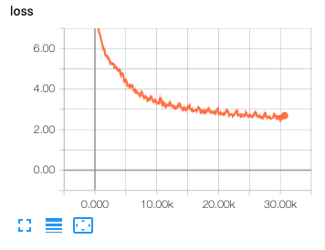
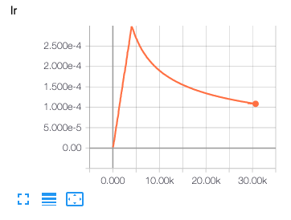
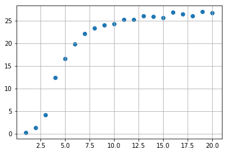

# **[UPDATED]** A TensorFlow Implementation of [Attention Is All You Need](https://arxiv.org/abs/1706.03762)

When I opened this repository in 2017, there was no official code yet.
I tried to implement the paper as I understood, but to no surprise
it had several bugs. I realized them mostly thanks to people who issued here, so
I'm very grateful to all of them. Though there is the [official implementation](https://github.com/tensorflow/tensor2tensor) as well as
several other unofficial github repos, I decided to update my own one.
This update focuses on:
* readable / understandable code writing
* modularization (but not too much)
* revising known bugs. (masking, positional encoding, ...)
* updating to TF1.12. (tf.data, ...)
* adding some missing components (bpe, shared weight matrix, ...)
* including useful comments in the code.

I still stick to IWSLT 2016 de-en. I guess if you'd like to test on a big data such
as WMT, you would rely on the official implementation.
After all, it's pleasant to check quickly if your model works.
The initial code for TF1.2 is moved to the [tf1.2_lecacy](tf1.2_legacy) folder for the record.

## Requirements
* python==3.x (Let's move on to python 3 if you still use python 2)
* tensorflow==1.12.0
* numpy>=1.15.4
* sentencepiece==0.1.8
* tqdm>=4.28.1

## Training
* STEP 1. Run the command below to download [IWSLT 2016 German–English parallel corpus](https://wit3.fbk.eu/download.php?release=2016-01&type=texts&slang=de&tlang=en).
```
bash download.sh
```
 It should be extracted to `iwslt2016/de-en` folder automatically.
* STEP 2. Run the command below to create preprocessed train/eval/test data.
```
python prepro.py
```
If you want to change the vocabulary size (default:32000), do this.
```
python prepro.py --vocab_size 8000
```
It should create two folders `iwslt2016/prepro` and `iwslt2016/segmented`.

* STEP 3. Run the following command.
```
python train.py
```
Check `hparams.py` to see which parameters are possible. For example,
```
python train.py --logdir myLog --batch_size 256 --dropout_rate 0.5
```

* STEP 3. Or download the pretrained models.
```
wget https://dl.dropbox.com/s/4lom1czy5xfzr4q/log.zip; unzip log.zip; rm log.zip
```


## Training Loss Curve


## Learning rate


## Bleu score on devset



## Inference (=test)
* Run
```
python test.py --ckpt log/1/iwslt2016_E19L2.64-29146 (OR yourCkptFile OR yourCkptFileDirectory)
```

## Results
* Typically, machine translation is evaluated with Bleu score.
* All evaluation results are available in [eval/1](eval/1) and [test/1](test/1).

|tst2013 (dev) | tst2014 (test) |
|--|--|
|28.06|23.88|

## Notes
* Beam decoding will be added soon.
* I'm going to update the code when TF2.0 comes out if possible.