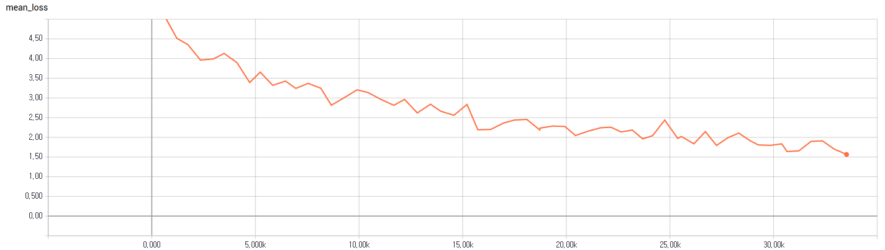
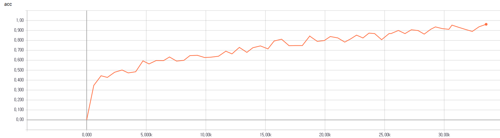

# A TensorFlow Implementation of the Transformer: Attention Is All You Need

## Requirements
  * NumPy >= 1.11.1
  * TensorFlow >= 1.2 (Probably 1.1 should work, too, though I didn't test it)
  * regex
  * nltk

## Why This Project?
I tried to implement the idea in [Attention Is All You Need](https://arxiv.org/abs/1706.03762). They authors claimed that their model, the Transformer, outperformed the state-of-the-art one in machine translation with only attention, no CNNs, no RNNs. How cool it is! At the end of the paper, they promise they will make their code available soon, but apparently it is not so yet. I have two goals with this project. One is I wanted to have a full understanding of the paper. Often it's hard for me to have a good grasp before writing some code for it. Another is to share my code with people who are interested in this model before the official code is unveiled.

## Differences with the original paper
I don't intend to replicate the paper exactly. Rather, I aim to implement the main ideas in the paper and verify them in a SIMPLE and QUICK way. In this respect, some parts in my code are different than those in the paper. Among them are
* I used the IWSLT 2016 de-en dataset, not the wmt dataset because the former is much smaller, and requires no special preprocessing.
* I constructed vocabulary with words, not subwords for simplicity. Of course, you can try bpe or word-piece if you want.
* I parameterized positional encoding. The paper used some sinusoidal formula, but Noam, one of the authors, says they both work. See the [discussion in reddit](https://www.reddit.com/r/MachineLearning/comments/6gwqiw/r_170603762_attention_is_all_you_need_sota_nmt/)
* The paper adjusted the learning rate to global steps. I fixed the learning to a small number, 0.0001 simply because training was reasonably fast enough with the small dataset (Only a couple of hours on a single GTX 1060!!).

## File description
  * `hyperparams.py` includes all hyper parameters that are needed.
  * `prepro.py` creates vocabulary files for the source and the target.
  * `data_load.py` contains functions regarding loading and batching data.
  * `modules.py` has all building blocks for encoder/decoder networks.
  * `train.py` has the model.
  * `eval.py` is for evaluation.

## Training
* STEP 1. Download [IWSLT 2016 German–English parallel corpus](https://wit3.fbk.eu/download.php?release=2016-01&type=texts&slang=de&tlang=en) and extract it to `corpora/` folder.
```sh
wget -qO- --show-progress https://wit3.fbk.eu/archive/2016-01//texts/de/en/de-en.tgz | tar xz; mv de-en corpora
```
* STEP 2. Adjust hyper parameters in `hyperparams.py` if necessary.
* STEP 3. Run `prepro.py` to generate vocabulary files to the `preprocessed` folder.
* STEP 4. Run `train.py` or download the [pretrained files](https://www.dropbox.com/s/fo5wqgnbmvalwwq/logdir.zip?dl=0).

## Training Loss and Accuracy
* Training Loss


* Training Accuracy


## Evaluation
  * Run `eval.py`.

## Results
I got a BLEU score of 17.14. (Recollect I trained with a small dataset, limited vocabulary) Some of the evaluation results are as follows. Details are available in the `results` folder.

source: Sie war eine jährige Frau namens Alex<br>
expected: She was a yearold woman named Alex<br>
got: She was a woman named yearold name

source: Und als ich das hörte war ich erleichtert<br>
expected: Now when I heard this I was so relieved<br>
got: And when I heard that I was an <UNK>

source: Meine Kommilitonin bekam nämlich einen Brandstifter als ersten Patienten<br>
expected: My classmate got an arsonist for her first client<br>
got: Because my first <UNK> came from an in patients

source: Das kriege ich hin dachte ich mir<br>
expected: This I thought I could handle<br>
got: I'll go ahead and I thought

source: Aber ich habe es nicht hingekriegt<br>
expected: But I didn't handle it<br>
got: But I didn't <UNK> it

source: Ich hielt dagegen<br>
expected: I pushed back<br>
got: I thought about it

source: Das ist es was Psychologen einen AhaMoment nennen<br>
expected: That's what psychologists call an Aha moment<br>
got: That's what a <UNK> like a <UNK>

source: Meldet euch wenn ihr in euren ern seid<br>
expected: Raise your hand if you're in your s<br>
got: Get yourself in your s

source: Ich möchte ein paar von euch sehen<br>
expected: I really want to see some twentysomethings here<br>
got: I want to see some of you

source: Oh yeah Ihr seid alle unglaublich<br>
expected: Oh yay Y'all's awesome<br>
got: Oh yeah you all are incredibly

source: Dies ist nicht meine Meinung Das sind Fakten<br>
expected: This is not my opinion These are the facts<br>
got: This is not my opinion These are facts
